<div align="center">

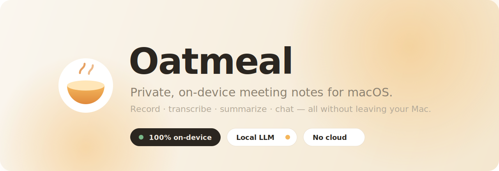

<h3>Private, on-device meeting notes for macOS.</h3>
<p><strong>Record any call, get a speaker-labeled transcript, AI notes, summaries &amp; action items, then chat with it.</strong><br/>
Everything runs on your Mac. No cloud. No account. No bots in your meetings.</p>

<p>
  
  
  
  
  
  
</p>

<sub>Built with <a href="https://github.com/FluidInference/FluidAudio">FluidAudio</a> (Parakeet &amp; Nemotron ASR + diarization), <a href="https://lmstudio.ai">LM Studio</a>, SwiftUI, and SwiftData</sub>

</div>

<br/>

> **Why Oatmeal?** Meeting notetakers are wonderful, and they usually ship your most sensitive
> conversations to someone else's servers. Oatmeal gives you the same magic (transcripts, AI
> summaries, action items, and "chat with your meeting") while every byte of audio and every model
> call stays on your machine. It's the cozy, private alternative.

<br/>

<div align="center">
  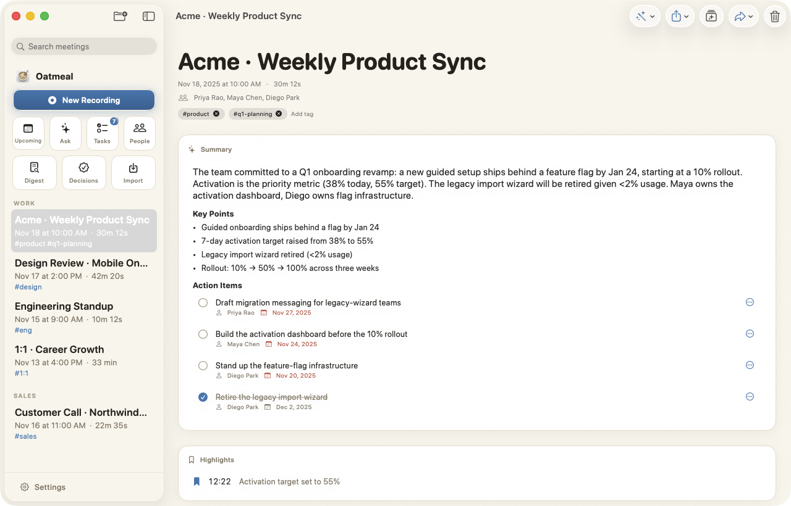
  <br/><sub>AI-enhanced notes with decisions, key numbers, and action items, grounded in the transcript.</sub>
</div>

<br/>

## ✨ Highlights

- 🎙️ **One-click capture:** records the other participants (system audio) **and** your mic. No meeting bots, no invite links. Works for online calls **and** in-person meetings (a one-tap switch by the record button).
- 🗣️ **Speaker-labeled transcripts:** on-device diarization with editable names, merge, and re-identify. A quick **confirm-speakers** step at wrap-up (shown only when names are uncertain) gets attribution right up front — and fixing a speaker afterward keeps the **summary, key points, and action items in sync** automatically (a plain rename patches them instantly; a structural change offers one-tap **Update summary**).
- ⚡ **Two transcription engines:** Parakeet (proven default) or NVIDIA's new **Nemotron streaming** model for live captions — swap anytime in Settings, both fully on-device.
- ✍️ **Notes that write themselves:** jot a few words, and the local LLM turns them into clean, structured notes.
- 🧠 **Summaries &amp; action items:** decisions, owners, numbers, and follow-ups, extracted automatically.
- 💬 **Chat with a meeting:** ask anything, and hybrid semantic + keyword retrieval grounds every answer in *that* meeting.
- 🌍 **Ask across everything:** query your whole history with tappable source citations.
- 📋 **Prep before the call:** from Upcoming, confirm who's speaking (names + emails pulled from the invite), jot talking points, and see your history with these people — the roster pre-labels speakers and feeds recap emails once you record.
- 🟢 **Live Assist:** when you're asked something, a discreet teleprompter near the top of your screen quietly suggests what to say next, in plain, spoken language. Built for interviews and sales.
- 🪟 **Floats over your call:** the cue and your record controls stay above full-screen video calls (Zoom, Teams, Meet), always one glance away.
- 🎬 **Alive, not flashy:** an audio-reactive record button and waveform, streaming notes, and tasteful motion throughout, all of it respecting Reduce Motion.
- ✅ **Tasks &amp; Reminders:** action items become tasks, and optionally sync to Apple Reminders.
- 🔌 **Local MCP server:** expose meetings (read-only) to agents like Claude.
- ⬆️ **One-click updates:** when a new version ships, Oatmeal offers to download and install it for you (signed + verified, powered by Sparkle). Toggle off in Settings to stay fully offline.
- 🔒 **Private by design:** no cloud, no telemetry, no account. Data lives in `~/Library/Application Support/Oatmeal`.

<br/>

## 📸 A tour

<table>
  <tr>
    <td width="50%" valign="top">
      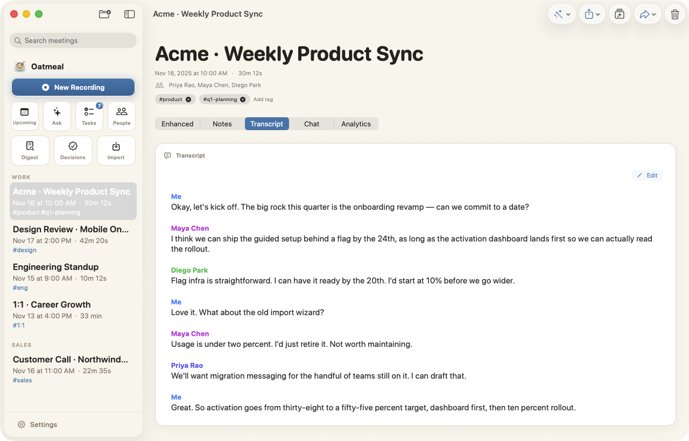<br/>
      <strong>Speaker-labeled transcript</strong><br/>
      <sub>Diarized on-device. Rename, merge, or re-identify speakers anytime.</sub>
    </td>
    <td width="50%" valign="top">
      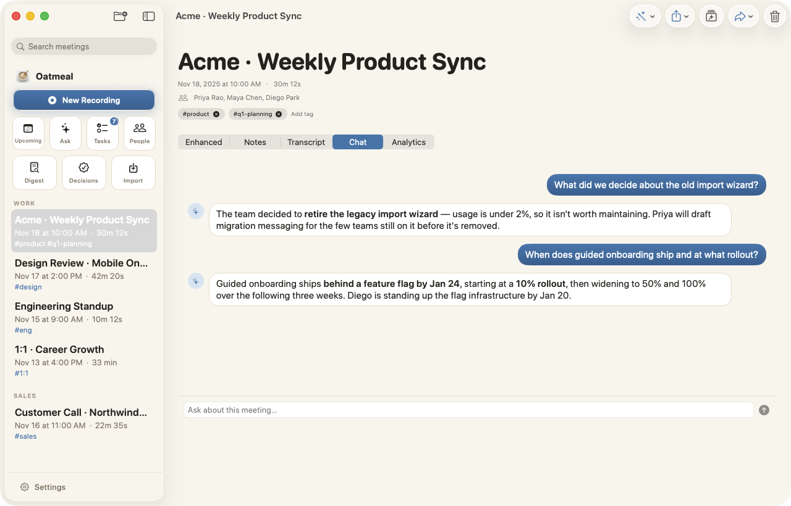<br/>
      <strong>Chat with the meeting</strong><br/>
      <sub>Answers are grounded only in this meeting, and hybrid retrieval finds what was said.</sub>
    </td>
  </tr>
  <tr>
    <td width="50%" valign="top">
      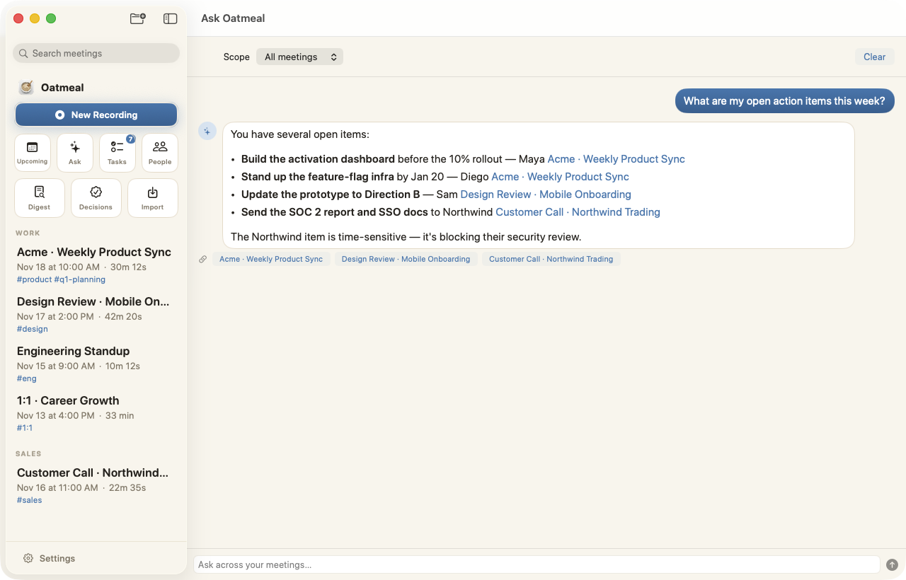<br/>
      <strong>Ask across all meetings</strong><br/>
      <sub>Cross-meeting answers with clickable source citations.</sub>
    </td>
    <td width="50%" valign="top">
      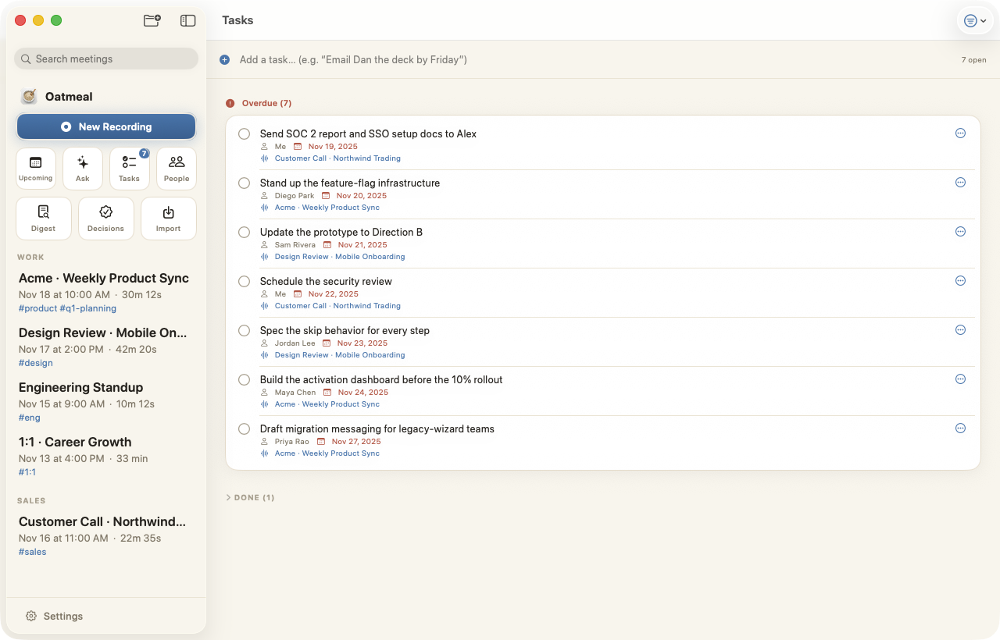<br/>
      <strong>Tasks, automatically</strong><br/>
      <sub>Action items with owners and due dates, collected across every meeting.</sub>
    </td>
  </tr>
  <tr>
    <td width="50%" valign="top">
      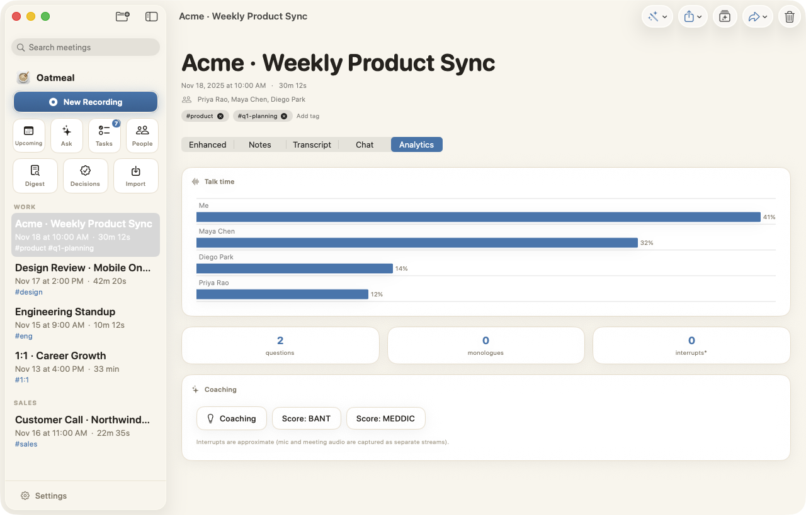<br/>
      <strong>Analytics &amp; coaching</strong><br/>
      <sub>Talk-time balance and conversation insights for each meeting.</sub>
    </td>
    <td width="50%" valign="top">
      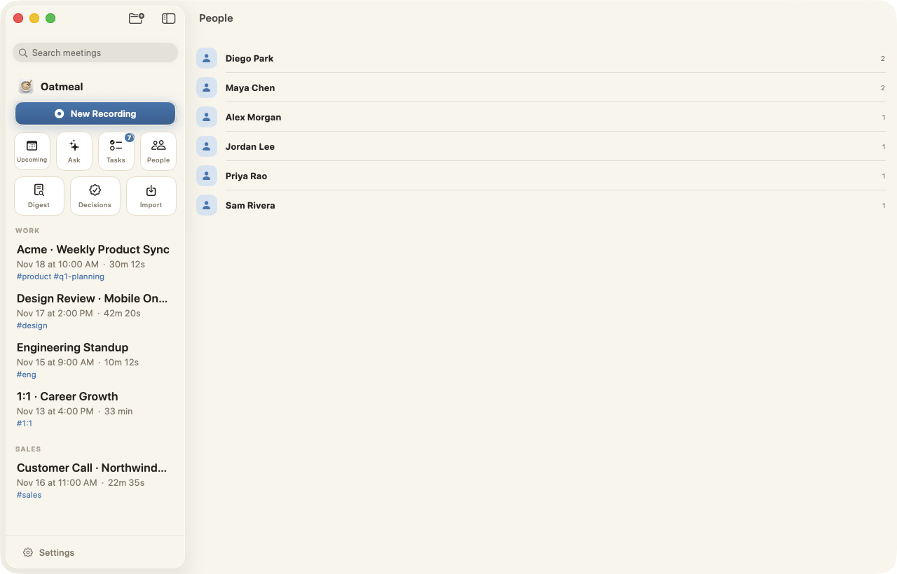<br/>
      <strong>People</strong><br/>
      <sub>Everyone you meet with, and the meetings you share.</sub>
    </td>
  </tr>
  <tr>
    <td width="50%" valign="top">
      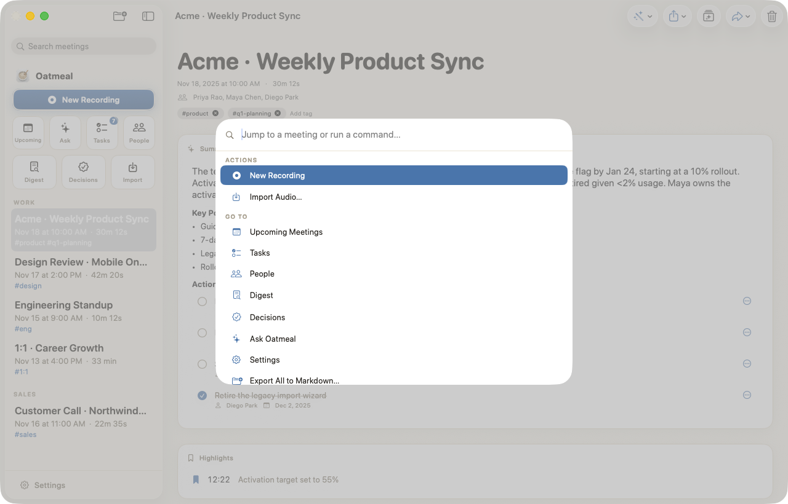<br/>
      <strong>Command palette (⌘K)</strong><br/>
      <sub>Jump to any meeting or run any command in a keystroke.</sub>
    </td>
    <td width="50%" valign="top">
      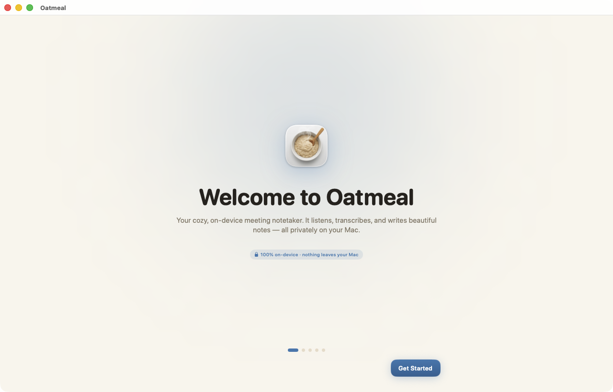<br/>
      <strong>Friendly first run</strong><br/>
      <sub>A short, private setup for mic, audio, and your local AI.</sub>
    </td>
  </tr>
</table>

<sub>Screens shown with fictional sample data.</sub>

<br/>

## 🚀 Quick start

### Requirements

- **macOS 14 (Sonoma)+**, Apple Silicon recommended
- **Xcode 15+**
- [**XcodeGen**](https://github.com/yonaskolb/XcodeGen): `brew install xcodegen`
- [**LM Studio**](https://lmstudio.ai) (or any OpenAI-compatible local server) for the AI features

> **First-run downloads.** The FluidAudio Swift package is fetched automatically when you build.
> The on-device speech models (Parakeet transcription + speaker-diarization weights, ~450 MB total)
> download automatically the first time you record. After that, transcription runs fully offline.
> Optional: switch live captions to NVIDIA's **Nemotron streaming** model in Settings →
> Transcription (Apple Silicon, ~0.5 GB more on first use, also fully on-device).

### 1 · Start your local AI

Install LM Studio, download a modern instruct model with a healthy context window, and start
its local server. Oatmeal talks to `http://127.0.0.1:1234` by default (configurable in
**Settings → AI**).

### 2 · Build & run

```bash
git clone https://github.com/superluis0/Oatmeal.git
cd Oatmeal
xcodegen generate        # generate Oatmeal.xcodeproj from project.yml
open Oatmeal.xcodeproj    # build & run the "Oatmeal" scheme
```

Prefer a scripted install? `reinstall.sh` builds to `/tmp` (Xcode can't code-sign inside an
iCloud-synced folder), installs to `~/Applications`, and signs with a **stable self-signed
identity** so macOS remembers your Mic and Screen-Recording grants across rebuilds:

```bash
./reinstall.sh && open ~/Applications/Oatmeal.app
```

### 3 · Grant permissions on first launch

| Permission | Why |
|---|---|
| **Microphone** | Transcribe your voice |
| **Screen Recording** | Required by macOS to capture *system audio* (the other participants) |
| **Calendar** *(optional)* | Auto-title meetings and show what's upcoming |
| **Reminders** *(optional)* | Push action items to an "Oatmeal" list |

> 💡 **Record with headphones.** Without them, the other party's audio plays out your speakers and
> leaks into your mic, which can duplicate transcript lines. Oatmeal de-duplicates this echo
> automatically, but headphones eliminate it at the source.

> 🖥️ **Screen Recording needs a relaunch to take effect.** macOS only applies a new Screen Recording
> grant after the app restarts — and Oatmeal keeps running in the menu bar, so **fully quit** it
> (menu-bar icon → Quit) and reopen after enabling it. If the other participants still aren't being
> captured, Oatmeal shows a clear "only your microphone is recording" warning (in-app and on the
> floating panel) instead of quietly saving a one-sided transcript.

<br/>

## 🔒 Privacy

Oatmeal is private by default:

- Audio, transcripts, notes, and embeddings live **only on your Mac**.
- Transcription and speaker diarization run **on-device**, so no audio is ever uploaded.
- LLM features call **only** the local server URL you configure.
- The optional webhook and MCP mirror are **off / local** unless you turn them on.

The only network activity is a **one-time download of the speech models** on first run, the calls
Oatmeal makes to **your own local LLM**, and an optional **once-a-day update check** (via
[Sparkle](https://sparkle-project.org), which fetches a small signed release feed over HTTPS;
toggle in Settings → Updates). Your audio and notes are never sent anywhere.

<br/>

## 🏗️ How it works

<div align="center">
  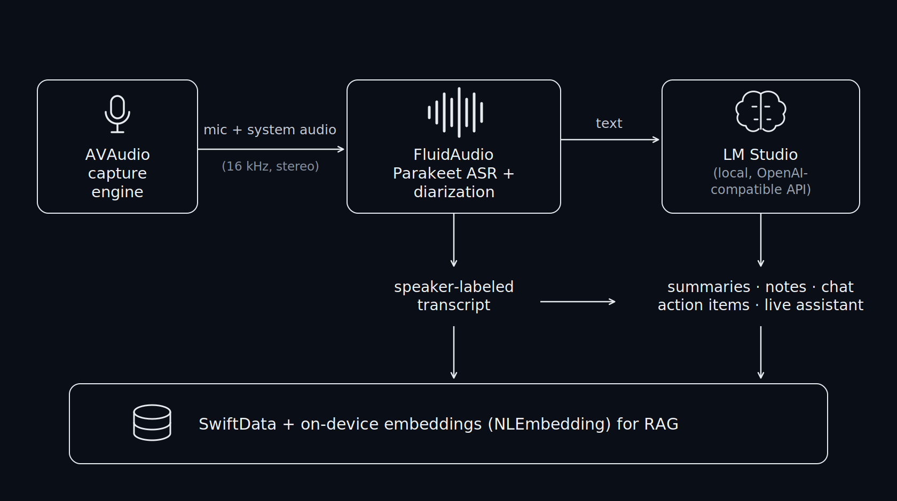
</div>

| Path | What |
|---|---|
| `Oatmeal/` | The macOS app (SwiftUI + SwiftData) |
| `OatmealMCP/` | A minimal stdio MCP server exposing the read-only meeting mirror |
| `project.yml` | XcodeGen project definition (the `.xcodeproj` is generated, not committed) |
| `reinstall.sh` | Build, install, and self-sign helper (local dev) |
| `release.sh` | Cut a signed, auto-updatable release + appcast — see [docs/RELEASING.md](docs/RELEASING.md) |

<br/>

## 🧑‍💻 Contributing

Issues and PRs are welcome! The Xcode project is generated by XcodeGen, so make project/target
changes in **`project.yml`** and run `xcodegen generate` (don't edit the `.xcodeproj` directly).

Cutting a release (signed build + one-click-update appcast) is documented in
**[docs/RELEASING.md](docs/RELEASING.md)**.

<br/>

## 📄 License

[MIT](LICENSE). Do anything you like; just keep the notice.

<div align="center"><sub>Made for people who want great meeting notes <strong>and</strong> their privacy. 🥣</sub></div>
